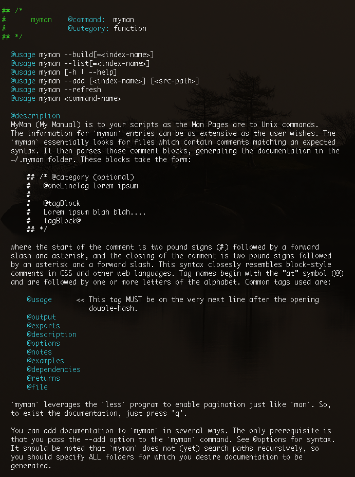
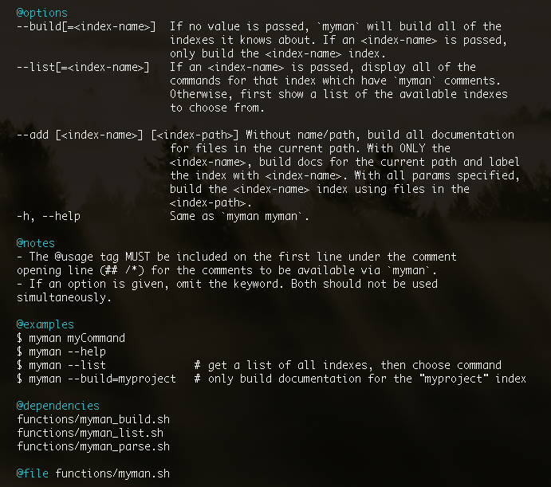

myman
=====

A collection of scripts which allows users to maintain documentation for Bash scripts by establishing a comment syntax.

Dependencies
------------

These are the *nix programs the scripts use. If on Linux, you'll have these.

- `less`
- `egrep`
- `grep`
- `sed`

Submodules
----------

`myman` uses some libraries to help out in scripts. Firstly, it implements colors from the [colorsh](https://github.com/Smolations/colorsh) project. However, the project is not a submodule because it is not absolutely necessary for `myman` to be functional. It just adds some style. The following submodules are _actual_ submodule dependencies:

- [__cfg](https://github.com/Smolations/__cfg) for app-specific settings
- [functionsh](https://github.com/Smolations/functionsh) for helper functions

These submodules are checked for initialization every time the user opens a new CLI tab/window OR sources `~/.bashrc`.

Usage
-----

What better way to show how to use `myman` than to show the `myman` documentation for it! The documentation is a bit lengthy to get it all in a screenshot, so it is broken into two sections:

### Usage and Description

### Options, Notes, and Examples

